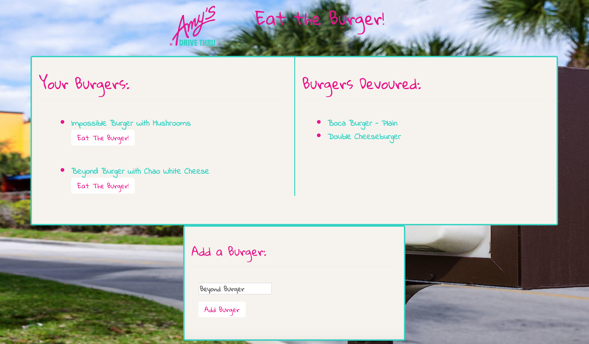

# :hamburger: Welcome to Amy's© Drive Thru! :hamburger:

## :fries: Where the Wildest Burger is Your Desire! :fries:

### The following project is a burger eating application based (loosely) on Amy's© in Petaluma, CA

I employed HTML, CSS, JavaScript, and jQuery on the front-end to make a burger-making and burger-devouring application. The front-end work is partially served as static pages, but most of the hard work is done by using Handlebars.js templates. Burgers can be made and stored in a MySQL database through the application by way of a homemade ORM, built using JavaScript through Node.js and Express.js.

### Using the Application:

* Visit the link to the Heroku deployed application at the bottom of this README, or at the top of the GitHub page

* View the burgers already available to be eaten, and the burgers that have already been eaten

* Add a burger of your own design at the bottom of the page

* Smash that "Eat The Burger" button and get devouring!

## 

 Object-oriented, functional programming allows us to minimize the amount of work each file does, making a more efficient application. In this instance, I built an ORM that works together with models and functions from other files to query a MySQL database. The creation of new data and rendering it to the DOM is done by separate, but connected files:

 ``` javascript
var connection = require("./connection.js");
var orm = {
    selectAll: function (tableInput, cb) {
        var queryString = "SELECT * FROM ??";
        connection.query(queryString, [tableInput], function (err, result) {
            cb(result);
        });
    },
    insertOne: function (table, cols, vals, cb) {
        var queryString = "INSERT INTO ?? (??) VALUES (?)";
        connection.query(queryString, [table, cols, vals], function (err, result) {
            cb(result);
        });
    },
    updateOne: function (table, ObjColVals, condition, id, cb) {
        var queryString = "UPDATE ?? SET ?? = ? WHERE id = ?";
        connection.query(queryString, [table, ObjColVals, condition, id], function (err, result) {
            cb(result);
        });
    }
};

module.exports = orm;
 ```
### Feel free to play around with the application by adding a burger or devouring one that's already on the list!

[Link to my Game](https://eat-the-burger-express.herokuapp.com/)

Thank you for reading!

### Built With:
* HTML
* CSS
* JavaScript
* jQuery Library
* Bootstrap CSS Library
* Node.js
* Express.js
* Handlebars.js
* MySQL
